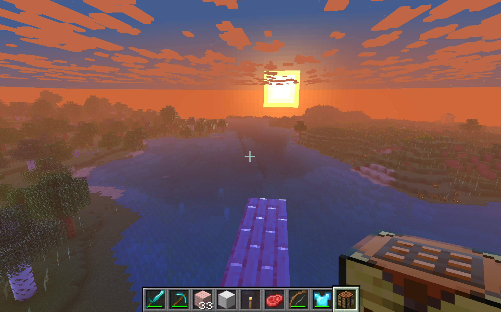
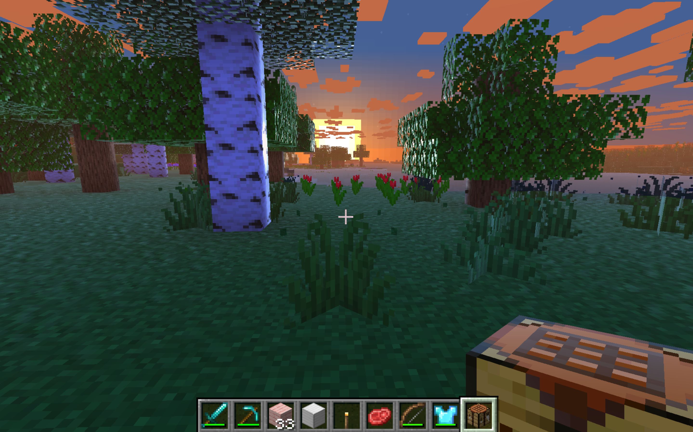
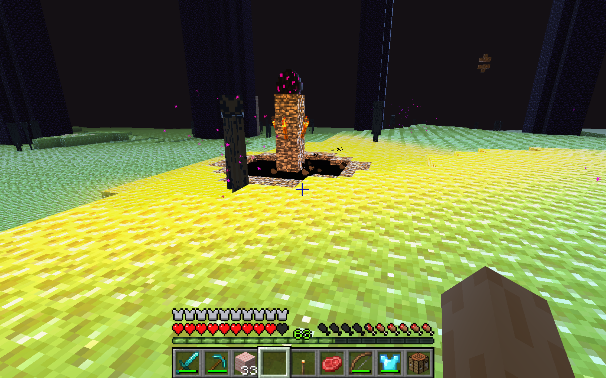

# AlooShaders

Simple shaders which i made using glsl for IrisMC. Meant for low end pc's by following a tutorial from the [iris docs](https://shaders.properties/current/guides/your-first-shaderpack/0_intro/)

Fun Fact: Aloo means potato in hindi which is meant to symbolise that my shaders are crap

## Features (from the tutorial)

- Shadows
- Fog

## Features (by me)
- dynamic and deffered lighting
- underwater fog
- Coloured clouds
- Slight PBR(requires resource pack)
- Moving foliage
- Water got waves with frensel effect
- Timing aware lighting (i.e it's darker or brighter based on the time of the day)

## Requirements

- Minecraft with [Iris Shaders](https://irisshaders.dev/) installed maybe even sodium
- A pc.....

## Installation

1. Download this repo (Code -> Download ZIP, or clone it)
2. Drop the shader folder into `.minecraft/shaderpacks`
3. Open Minecraft, go to Options -> Video Settings -> Shaderpacks, and select AlooShaders

## Known issues / stuff I skipped
- No bloom, or ambient occlusion
- transparent hands
- No volumetric clouds, just tuned vanilla ones
- Probably still tanks your FPS a bit even though it's meant for low-end PCs, no promises

## Credits

- Built by following the [Iris shader tutorial](https://shaders.properties/current/guides/your-first-shaderpack/0_intro/)
- Everything past the tutorial (clouds, foliage, waves, day/night lighting,etc) is MADE BY ME.
- Resource Pack used is [Vanilla Mashup 1.5](https://modrinth.com/resourcepack/vanilla-mashup-pbr)

## Gallery

